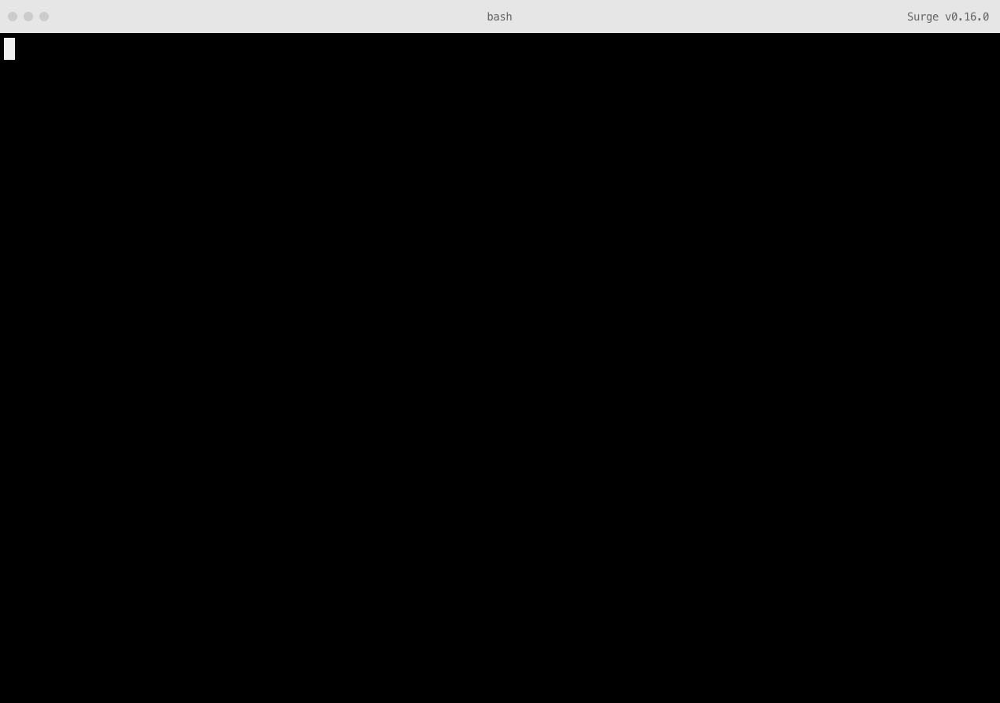

# Commander example

How to expose [the Surge CLI](https://github.com/sintaxi/surge) within your own command line tool, built with [Commander](https://github.com/tj/commander.js).



## Getting started

This example command line tool will show you how to build Surge into your own CLI, using Commander. [The code](bin/example) is commented, and shows some basic pre- and post-run hooks you can add between Surge’s steps.

First, clone the repository and install its dependencies:

```sh
# Clone the repository
git clone https://github.com/surge-sh/example-commander
cd example-commander

# Install dependencies
npm install
```

Then, you can run the binary to test this module locally with:

```sh
example
```

Try running `example publish` to see the hooks in action:

```sh
example publish
```

## Hooks

Here are all the pre- and post-run hooks available:

- `hooks.preAuth`
- `hooks.postAuth`
- `hooks.preProject`
- `hooks.postProject`
- `hooks.preSize`
- `hooks.postSize`
- `hooks.preDomain`
- `hooks.postDomain`
- `hooks.prePublish`
- `hooks.postPublish`

## License

[The MIT License (MIT)](LICENSE.md)

Copyright © 2015 [Chloi Inc.](http://chloi.io)
